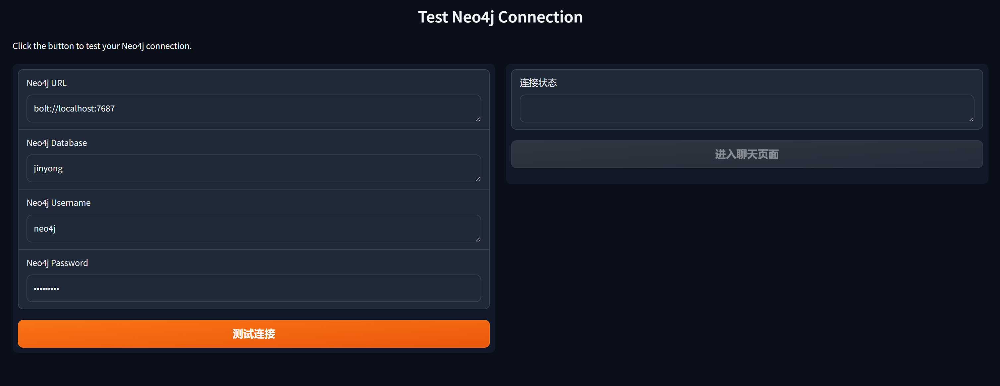
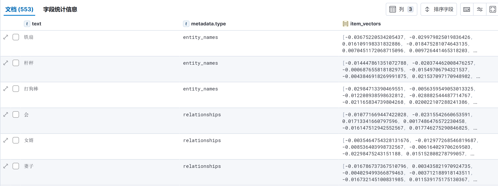
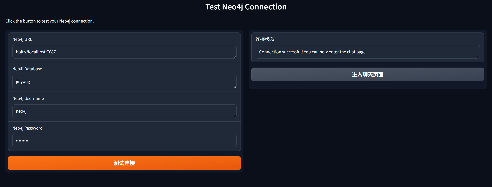
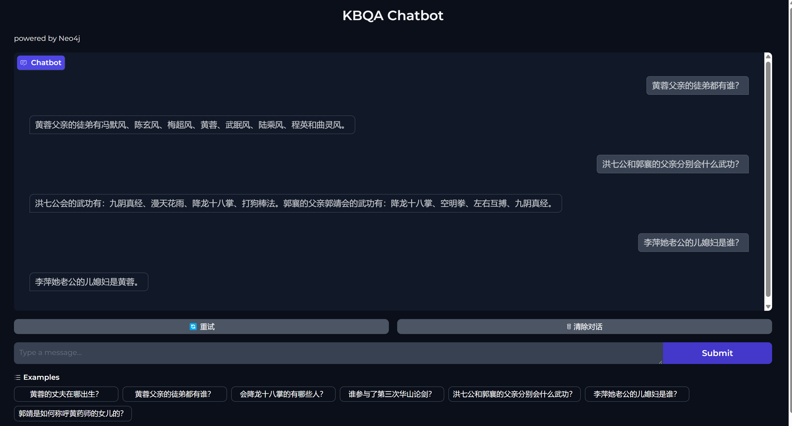
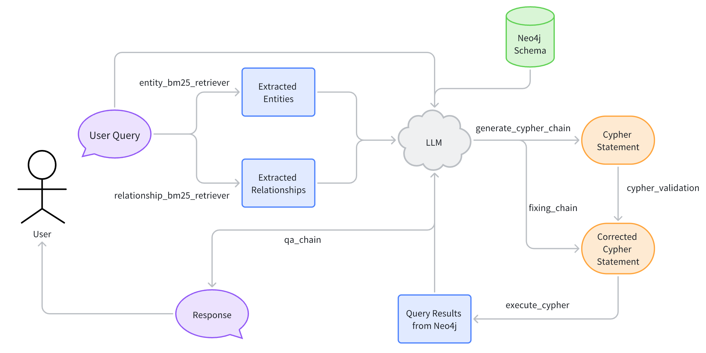

# Text2Cypher_KBQA4Neo4j

> 本项目完成了一个基于Neo4j的KBQA系统，使用Langchain框架实现了一套Text2Cypher的Pipeline，来回答用户针对特定私有知识图谱的提问。

## Setup

### Environment

安装 [Conda](https://conda.io/projects/conda/en/latest/user-guide/install/index.html).

创建新的 Conda 环境:

```
conda create -n kbqa python=3.10
```

然后激活该环境:

```
conda activate kbqa
```

最后安装所需的 Python 包:

```
pip install -r requirements.txt
```

### Setting

项目中所有可以自定义的参数都在 `tools/setting.py` 中，以下是该文件中各个参数的详细介绍：

| Parameter         | Meaning                           | Type             | Default                                                      |
| ----------------- | :-------------------------------- | ---------------- | ------------------------------------------------------------ |
| MY_EMBEDDING      | 嵌入模型                          | OpenAIEmbeddings | AzureOpenAIEmbeddings(<br />model="embedding-ada02",  azure_endpoint=os.getenv("MY_AZURE_OPENAI_ENDPOINT"),     api_key=os.getenv("MY_AZURE_OPENAI_API_KEY"),     api_version="2024-06-01") |
| MY_LLM            | 用于生成Cypher和问答的大模型      | BaseChatOpenAI   | AzureChatOpenAI( azure_endpoint=os.getenv("MY_AZURE_OPENAI_ENDPOINT"),     api_key=os.getenv("MY_AZURE_OPENAI_API_KEY"),     api_version="2024-06-01", <br />azure_deployment="gpt4o", <br />temperature=0) |
| ES_URL            | ElasticSearch的Client的URL        | String           | "http://localhost:9200"                                      |
| INIT_URL          | Neo4j的Client的URL默认值          | String           | "bolt://localhost:7687"                                      |
| INIT_DATABASE     | 要进行问答的Neo4j数据库名称默认值 | String           | "jinyong"                                                    |
| INIT_USERNAME     | 数据库用户名                      | String           | "neo4j"                                                      |
| INIT_PASSWORD     | 数据库的密码                      | String           | "neo4j"                                                      |
| QUESTION_EXAMPLES | 用来测试的问题样例列表            | List[String]     | ["黄蓉的丈夫在哪出生？", "黄蓉父亲的徒弟都有谁？", "会降龙十八掌的有哪些人？", "谁参与了第三次华山论剑？", "洪七公和郭襄的父亲分别会什么武功？", "李萍她老公的儿媳妇是谁？", "郭靖是如何称呼黄药师的女儿的？"] |

### Running Demo

在配置好个性化的 Setting 之后，可以通过运行 `client.py` 来运行 Demo：

```
python client.py
```

## Demo Workflow

### Test Connection

Demo Server成功运行后，用户可以在默认路由设置 Neo4j 的相关连接配置并测试连接



### ES Indexing

在测试连接时，系统还会完成 ES 对于该数据库内实体名称（Entity Name）和关系类型（Relationship Type）的向量化存储过程，ES 会检查当前数据库有无同名 index，没有则建立一个新 index，ES 的 index 存储模式如下所示（以 “jinyong” 知识图谱为例）：



在 Neo4j 连接测试成功，ES 索引检查/建立完毕后，用户可以进入聊天页面进行 QA 问答：



### KBQA Chatbot

Chat 界面如图所示，上方为问答区域，问答区域下方有重试和清除对话按钮、问题输入框，以及用户在 `setting.py` 里设置好的问题示例，图中展示了几个多跳问题的回答情况：



这里问答过程的 pipeline 如下图所示：



1. 首先使用 BM25 匹配算法，在 ES 中检索用户 Query 中出现的实体名称（Entity Name）和关系类型（Relationship Type）。我们在`tools/elastic_search_bm25.py` 中封装了自定义的检索器类，它使用归一化后的 BM25 Score作为阈值检索 top-k 的结果列表。

2. 随后，我们将用户 Query、提取出的实体名称、关系类型以及 Neo4j 数据库的 schema 提供给 LLM，让其给我们初步生成一个可以用来回答用户问题的 Cypher 语句。
3. 接着，我们使用 CypherQueryCorrector 类构建一个 cypher_validation 来纠正该 Cypher 可能存在的一些基本语法错误，然后将这个纠正的 Cypher 语句传入自主设计的一个 fixing_chain，该 chain 尝试运行 Cypher语句，如若运行报错，则将该语句及其报错信息交给 LLM 进行进一步纠正，共尝试三次，最后我们基本可以得到一个可以运行的 Cypher 语句。
4. 最后，我们运行该 Cypher 语句返回结果列表，并将问题和结果列表交给 LLM 让其生成最终的回答。
